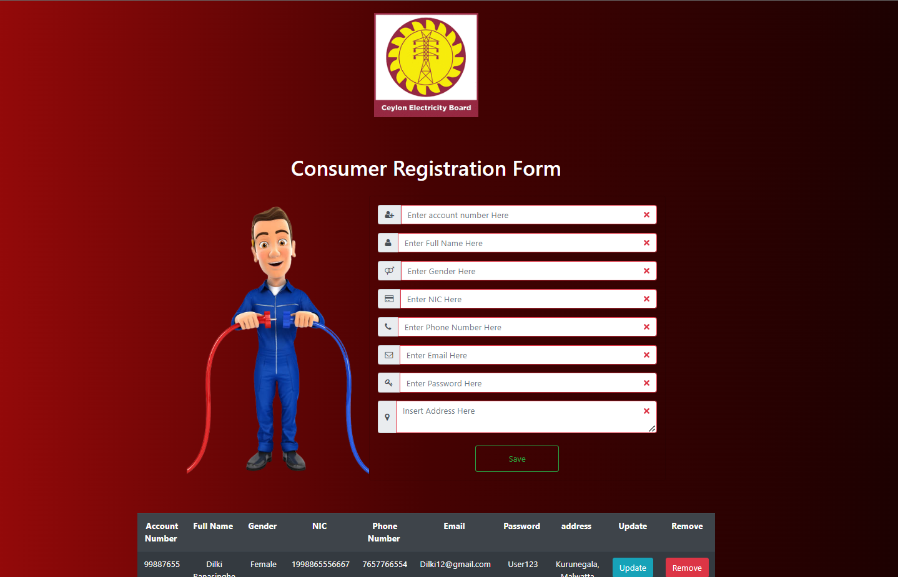

# Rich Frontend for ElectroGrid 

## IT Number - IT20096748

### Name - Manchalee R.R.N.

### Batch - Y3.S1.WE.IT.02

 

### Brief Description about the project-
ElectroGrid (EG) is the company who maintains the power grid of the country. They have a system to 
monitor the power consumption of the users, generate the monthly bills and automatically send to the 
users, and accept the online payments from the users.

 

#### Technologies used

RESTful web service: Java – JAX-RS (Jersey) on Tomcat
 

DB: PhpMyadmin
 

View: HTML, CSS, Bootstrap (optional), Form and Grid UI design pattern
 

Client-components: jQuery, Ajax for DC.

 
 

